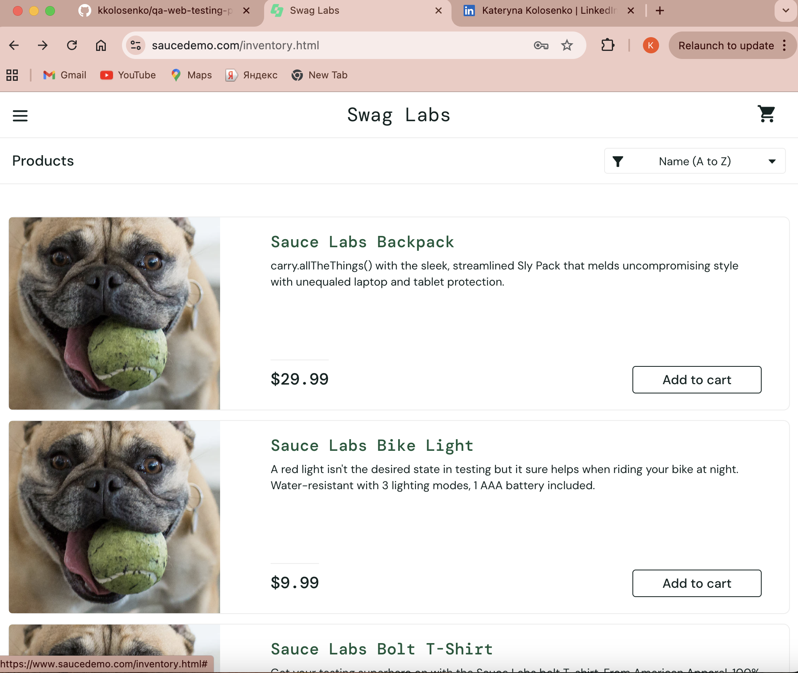

# BUG-002 – Unexpected text/codes are displayed in product names and descriptions

| Field | Details |
|---|---|
| **Bug ID** | BUG-002 |
| **Related Test Case** | TC-008 |
| **Environment** | Google Chrome, Desktop |
| **Test Account** | `standard_user` |
| **Severity** | Low |
| **Priority** | Medium |
| **Status** | Open |

## Preconditions

User is on the SauceDemo Login page.

## Steps to Reproduce

1. Enter `standard_user` in the Username field.
2. Enter `secret_sauce` in the Password field.
3. Click **Login**.
4. Review the product names and descriptions on the Products page.
5. Open the affected product and review its name and description on the Product Details page.

## Expected Result

Product names and descriptions should contain correct, relevant, and properly formatted product information without unexpected text or codes.

## Actual Result

Unexpected extra text/codes are displayed in product names and/or descriptions.

## Evidence

