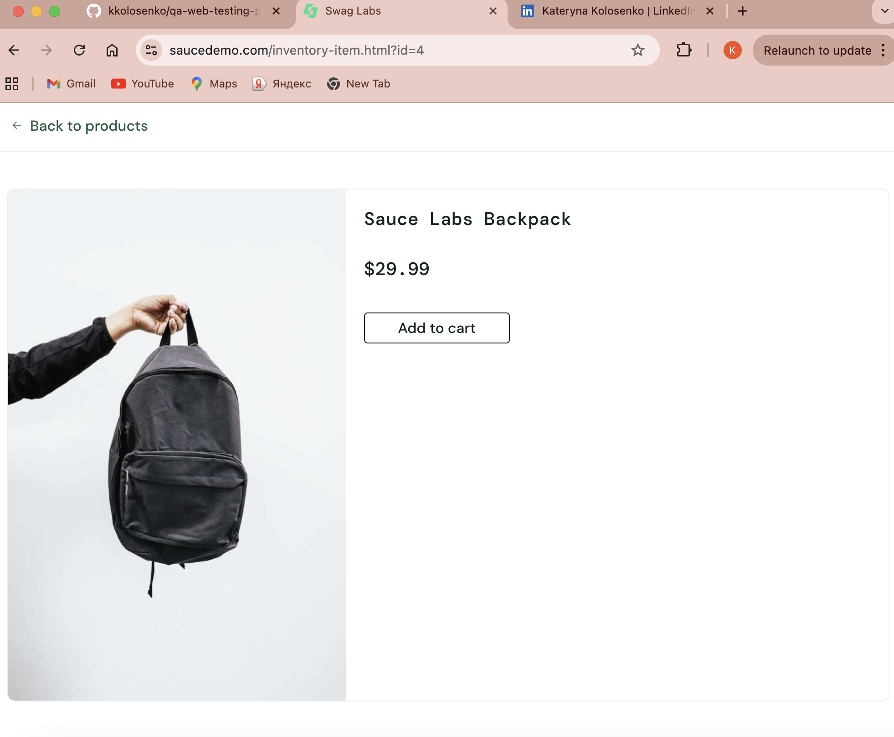

# BUG-004 – Product description is missing for error_user

| Field | Details |
|---|---|
| **Bug ID** | BUG-004 |
| **Related Test Case** | TC-010 |
| **Environment** | Google Chrome, Desktop |
| **Test Account** | `error_user` |
| **Severity** | Medium |
| **Priority** | Medium |
| **Status** | Open |

## Preconditions

User is on the SauceDemo Login page.

## Steps to Reproduce

1. Enter `error_user` in the Username field.
2. Enter `secret_sauce` in the Password field.
3. Click **Login**.
4. Open the Products page.
5. Click on a product to open the Product Details page.
6. Review the product information.

## Expected Result

The Product Details page should display complete product information, including the product name, image, description, and price.

## Actual Result

The product description is missing on the Product Details page.

## Evidence

