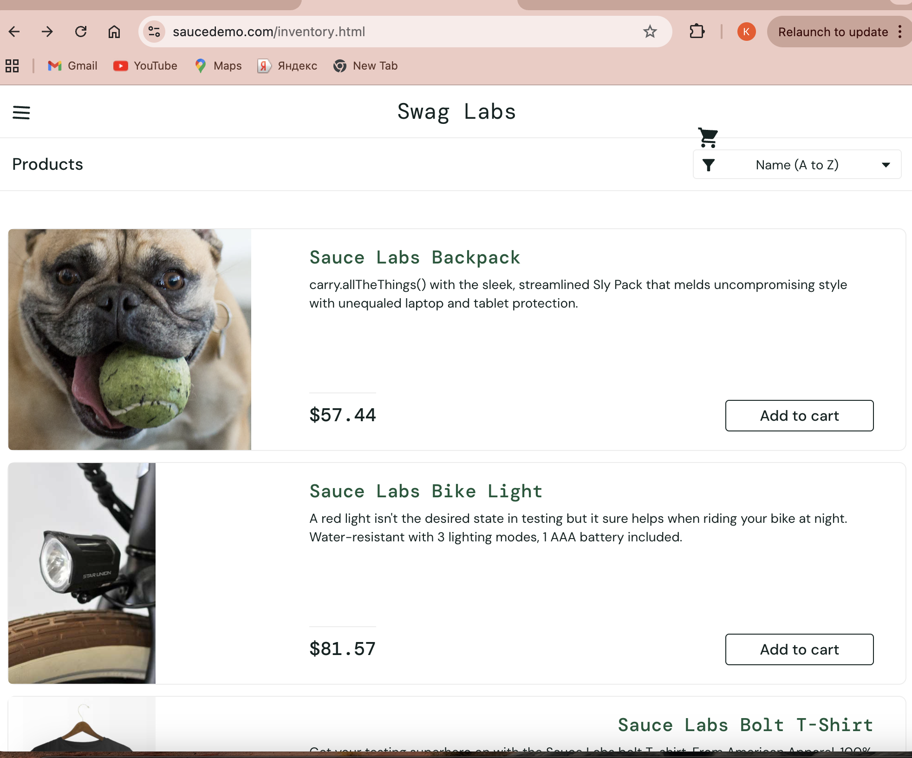

# BUG-005 – Product image and UI elements are displayed incorrectly for visual_user

| Field | Details |
|---|---|
| **Bug ID** | BUG-005 |
| **Related Test Case** | TC-011 |
| **Environment** | Google Chrome, Desktop |
| **Test Account** | `visual_user` |
| **Severity** | Medium |
| **Priority** | Medium |
| **Status** | Open |

## Preconditions

User is on the SauceDemo Login page.

## Steps to Reproduce

1. Enter `visual_user` in the Username field.
2. Enter `secret_sauce` in the Password field.
3. Click **Login**.
4. Review the Products page.
5. Observe product images and the position of UI elements.
6. Navigate through the application pages and observe the interface.

## Expected Result

Product images should correspond to the correct products. All UI elements should be displayed correctly, remain properly aligned, and maintain consistent positioning.

## Actual Result

An incorrect dog image is displayed instead of the corresponding product image. Some UI elements are incorrectly positioned and shift during navigation.

## Evidence

