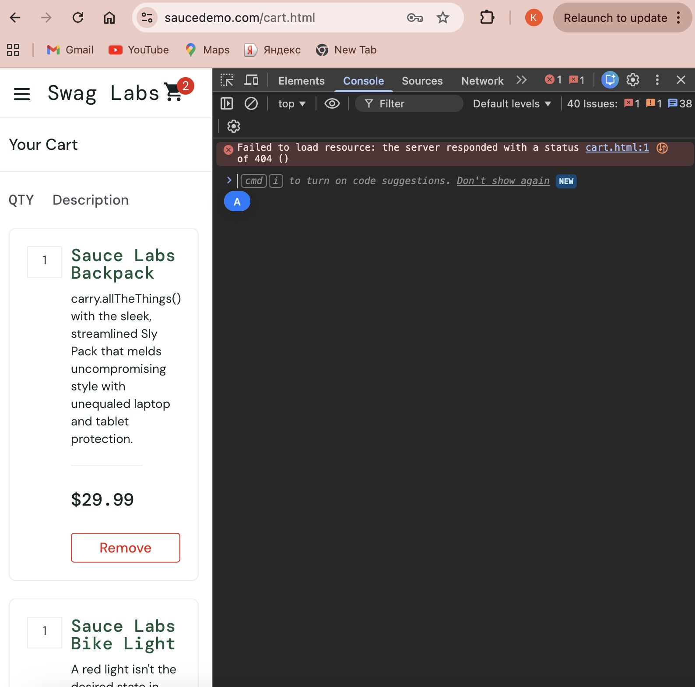

# BUG-008 – Product images fail to load on the Cart page

| Field | Details |
|---|---|
| **Bug ID** | BUG-008 |
| **Related Test Cases** | TC-052, TC-054 |
| **Environment** | Google Chrome, Desktop |
| **Test Account** | `standard_user` |
| **Severity** | Medium |
| **Priority** | Medium |
| **Status** | Open |

## Preconditions

User is logged in as `standard_user` and Chrome DevTools is available.

## Steps to Reproduce

1. Add a product to the cart from the Products page.
2. Click the **Cart** icon.
3. Observe the product displayed on the Cart page.
4. Open Chrome DevTools.
5. Open the **Console** tab.
6. Refresh the Cart page if necessary.
7. Observe the Console for errors related to the product image.

## Expected Result

Product images should load and be displayed correctly on the Cart page. No application-related errors associated with loading the product images should appear in the browser Console.

## Actual Result

Product images fail to load on the Cart page. A related error is displayed in the browser Console.

## Evidence

